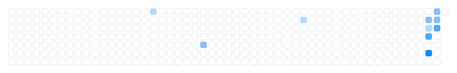

<picture>
  <source media="(prefers-color-scheme: dark)" srcset="assets/hero-dark.svg">
  
</picture>

 

**Designer · Engineer · Storyteller.** I build calm, useful things where design meets AI — from polished macOS apps and AI-native workflows to visual content people actually enjoy reading.

  

<table align="center" cellspacing="0" style="max-width: 640px; border-collapse: collapse">
  <tr>
    <td align="center" style="padding: 8px 20px; font-weight: 600; font-size: 16px">✦ Design</td>
    <td align="center" style="padding: 8px 20px; font-weight: 600; font-size: 16px">✦ Engineering</td>
    <td align="center" style="padding: 8px 20px; font-weight: 600; font-size: 16px">✦ Storytelling</td>
  </tr>
  <tr>
    <td align="center" style="padding: 0 20px; color: #86868b; font-size: 13.5px; line-height: 1.7">视觉内容 · 排版 公众号 · 小红书 · PPT</td>
    <td align="center" style="padding: 0 20px; color: #86868b; font-size: 13.5px; line-height: 1.7">AI 工具生态 macOS 工具 · Skill 开发</td>
    <td align="center" style="padding: 0 20px; color: #86868b; font-size: 13.5px; line-height: 1.7">AI 工作流教程 产品文档 · 经验分享</td>
  </tr>
</table>

  

contributions · last 12 months

  

<b style="font-size: 15px">✦ Latest writing</b>

<!-- BLOG-POST-LIST:START -->
<!-- BLOG-POST-LIST:END -->

 

<a href="https://nick-space-blog.vercel.app/" style="color: inherit; text-decoration: none">Blog</a>
&nbsp;·&nbsp;
<a href="https://github.com/Nick-Job" style="color: inherit; text-decoration: none">GitHub</a>

Designed by Nick · 2026

